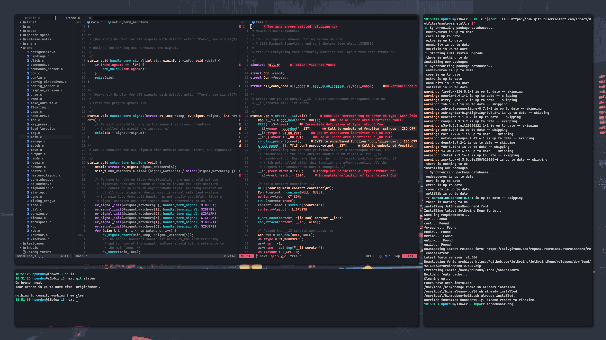

# .dotfiles



i primarily work with [c++](https://isocpp.org/), [gl2](https://www.khronos.org/opengl/), [valgrind](https://valgrind.org/), [gdb](https://www.sourceware.org/gdb/), and [zsh](https://www.zsh.org/) shell scripts. these dots are configured to assist this work flow.

only supporting arch and it's derivatives for the moment.

## features and usage

#### i3 \[xorg wm\]
no longer need the gaps fork since it's been merged into the original tree. used alongside xss-lock, i3lock, and feh.

#### picom \[i3 compositor\]
technically a [fork](https://github.com/ibhagwan/picom) of the original picom source, that adds dual kawase blur and rounded corners.
- `picom`: technically started by i3 session for you, but you can also start it manually.

#### kitty \[terminal\]
i keep a relatively minimal kitty config and primarily focus on theme matching neovim.

#### zsh \[scripting\]
currently using oh-my-zsh over p10k.
- `ic`: opens i3 config in neovim.
- `l`: ls with extra arguments.
- `sa`: source zsh config.
- `v` : alias for nvim.
- `zc`: open zsh config in neovim.

#### neovim \[editor\]
recently moved from packer to lazy and refactored my config to match.

#### ranger \[file explorer\]
simple curses based file explorer.

#### rofi \[dmenu clone\]
great application launcher with theme support.
- `i3modifier + d`: start rofi.

#### valgrind \[profiler\]
memory profiler and efficiency tool for c/c++ development.
- `valgrind -h`: for info.

#### gdb \[debugger\]
general debug tool for c/c++ development.
- `gdb -h`: for info.

#### apitrace \[gl-debugging tool\]
great tool for analyzing gl api calls during renders.
- `apitrace -h`: for info.

## install
1. run: `git clone git@github.com:i3b4cx/dotfiles.git ~/.dotfiles`
2. change the name and email address in `git/.config/git/config`
**WARNING: This may install and/or remove software and change your configs!**
3. run: `~/dotfiles/install.sh`

## quick and dirty:
**WARNING: This may install and/or remove software and change your configs!**
run this:
```shell
$ sh -c "$(curl -fsSL https://raw.githubusercontent.com/i3b4cx/dotfiles/master/install.sh)"
```
